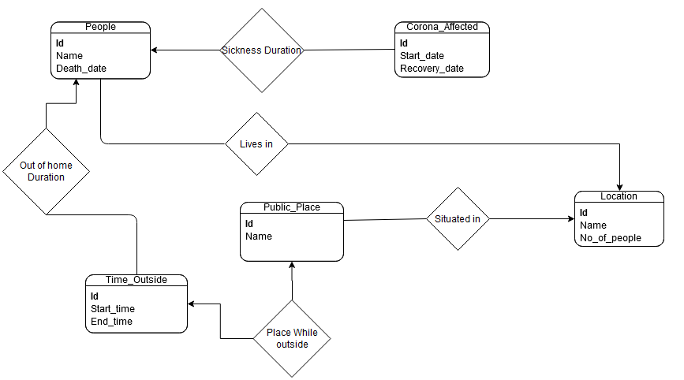

## A simple postgres based project regarding covid-19 data analyses that contains a schema and some queries

ER Diagram



DDL Statements:
```sql
create table location
(
	id int primary key,
	name varchar(50) not null,
	no_of_people int 
);

create table people
(
	id int primary key,
	location_id int REFERENCES location(id),
	name varchar(50) not null,
	death_date date 
);

create table public_place
(
	id int primary key , 
	name varchar(50) not null ,
	location_id int references location(id) not null
);

create table corona_affected
(
	id int primary key , 
	start_date date , 
	recover_date date ,
	people_id int references people(id) not null
);

create table time_outside
(
	id int primary key , 
	start_time timestamp ,
	end_time timestamp ,
	people_id int references people(id) not null ,
	public_place_id int references public_place(id) not null
	
);
```
DML Statements:
```sql
insert into location (id, name, no_of_people) values (1, 'Annnora', 12);
insert into location (id, name, no_of_people) values (2, 'Tim', 28);
insert into location (id, name, no_of_people) values (3, 'Corny', 13);
insert into location (id, name, no_of_people) values (4, 'Paddie', 49);
insert into location (id, name, no_of_people) values (5, 'Damara', 8);
insert into location (id, name, no_of_people) values (6, 'Fair', 69);
insert into location (id, name, no_of_people) values (7, 'Sisile', 70);
insert into location (id, name, no_of_people) values (8, 'Hildagard', 20);
insert into location (id, name, no_of_people) values (9, 'Lindsy', 76);
insert into location (id, name, no_of_people) values (10, 'Shandy', 70);

INSERT INTO "people" (id,location_id,name,death_date) VALUES (1,2,'Yasir Frank','Jul 17, 2021'),(2,9,'Gannon Keith','Jun 17, 2020'),(3,3,'Eric Welch','Nov 4, 2019'),(4,9,'Jared Brewer','May 3, 2020'),(5,6,'Channing Sweet','Oct 20, 2020'),(6,1,'Curran English','Nov 25, 2019'),(7,7,'Arthur Mason','May 25, 2020'),(8,3,'Colton Marsh','Feb 1, 2020'),(9,1,'Solomon Harris','Oct 6, 2020'),(10,8,'Cyrus Finley','Feb 8, 2021');
INSERT INTO "people" (id,location_id,name,death_date) VALUES (11,5,'Maxwell Vincent','Feb 28, 2020'),(12,3,'Derek Dillon','Aug 24, 2020'),(13,6,'Stone Dean','Mar 23, 2021'),(14,8,'Rudyard Pickett','Nov 22, 2019'),(15,8,'Dorian Guerra','Nov 12, 2019'),(16,2,'Laith Mcmillan','Feb 29, 2020'),(17,10,'Herman Brewer','Mar 13, 2020'),(18,3,'Vincent Avila','Dec 28, 2019'),(19,9,'John Pollard','Mar 24, 2020'),(20,4,'Cooper Chapman','Jul 28, 2021');
INSERT INTO "people" (id,location_id,name,death_date) VALUES (21,1,'Hammett Fields','Nov 13, 2020'),(22,2,'Forrest Myers','Feb 28, 2021'),(23,5,'Hu Marshall','Mar 28, 2020'),(24,4,'Jonah Craig','Sep 27, 2021'),(25,4,'Hedley Moon','Jan 19, 2020'),(26,8,'Cruz Hill','Mar 3, 2020'),(27,9,'Duncan Cabrera','Nov 16, 2019'),(28,4,'Tucker Fry','Sep 12, 2020'),(29,5,'Marshall Coffey','Aug 12, 2020'),(30,6,'Paki Osborn','Jun 18, 2021');
INSERT INTO "people" (id,location_id,name,death_date) VALUES (31,5,'William Dejesus','Feb 9, 2021'),(32,10,'Merrill Watkins','Jul 28, 2021'),(33,4,'Marsden Ayala','Apr 3, 2021'),(34,1,'Otto Rodgers','Dec 11, 2020'),(35,7,'William Simpson','Apr 8, 2020'),(36,5,'Wallace Byers','Jan 22, 2020'),(37,9,'Maxwell Herring','Jan 10, 2020'),(38,10,'Finn Warner','Oct 8, 2020'),(39,1,'Henry Rogers','Nov 12, 2019'),(40,1,'Fletcher Frazier','Nov 23, 2019');
INSERT INTO "people" (id,location_id,name,death_date) VALUES (41,2,'Christopher Lamb','Apr 16, 2020'),(42,3,'Wang Hebert','Mar 20, 2020'),(43,2,'Hall Stanton','Jun 4, 2020'),(44,2,'Eric Villarreal','Jan 3, 2021'),(45,4,'Robert Nicholson','Aug 30, 2020'),(46,10,'Clark Riddle','Feb 23, 2020'),(47,8,'Tyler Lara','Oct 19, 2020'),(48,3,'Clark Spence','Sep 17, 2021'),(49,3,'Wylie Cline','Apr 8, 2021'),(50,3,'William Nelson','Feb 21, 2020');
INSERT INTO "people" (id,location_id,name,death_date) VALUES (51,5,'Sawyer Gross','Mar 26, 2021'),(52,1,'Nathan Richards','Jun 18, 2021'),(53,1,'Tad Peterson','Jan 28, 2020'),(54,6,'Akeem Mclean','Jan 15, 2021'),(55,4,'Raymond Haynes','Aug 1, 2020'),(56,10,'Samuel Gardner','Oct 28, 2021'),(57,6,'Craig Greer','Oct 10, 2021'),(58,4,'Tanner Guzman','Feb 3, 2021'),(59,2,'Mark Guy','Nov 3, 2020'),(60,1,'Joshua Allen','May 26, 2021');
INSERT INTO "people" (id,location_id,name,death_date) VALUES (61,7,'Macon Lowery','Jan 12, 2021'),(62,3,'Ashton Olsen','Dec 8, 2020'),(63,8,'Joseph Harding','Apr 9, 2020'),(64,1,'Keith Baker','Mar 26, 2020'),(65,7,'Clayton Rojas','Oct 25, 2021'),(66,1,'Carlos Horn','Jul 3, 2020'),(67,5,'Sylvester Miller','Aug 6, 2020'),(68,5,'Conan Peters','Dec 22, 2019'),(69,5,'Colt Stafford','Jul 24, 2021'),(70,10,'Wylie Harvey','Nov 13, 2020');
INSERT INTO "people" (id,location_id,name,death_date) VALUES (71,4,'Wallace Martin','Jan 31, 2020'),(72,3,'Alan Stanton','Dec 5, 2020'),(73,6,'Thomas Simon','Aug 26, 2020'),(74,7,'Hilel Moreno','Nov 28, 2020'),(75,8,'Kuame Johns','May 31, 2020'),(76,5,'Wyatt Mccarthy','Jun 26, 2020'),(77,6,'Brandon Ross','Nov 23, 2020'),(78,4,'Andrew Doyle','Sep 13, 2021'),(79,7,'Tyrone Davenport','Nov 4, 2019'),(80,9,'Nolan Kane','Jun 28, 2021');
INSERT INTO "people" (id,location_id,name,death_date) VALUES (81,9,'Herman Henderson','Sep 25, 2020'),(82,9,'Joel William','Aug 22, 2021'),(83,4,'Isaiah Gilliam','Sep 22, 2021'),(84,3,'Keefe Griffin','Sep 18, 2021'),(85,4,'Cairo Randolph','Jun 17, 2020'),(86,10,'Walter Ramsey','Jul 22, 2020'),(87,10,'Fulton Wagner','Mar 22, 2020'),(88,2,'Cairo Beard','Dec 2, 2019'),(89,1,'Judah Cook','Nov 1, 2020'),(90,5,'Carson Blevins','Jun 7, 2020');
INSERT INTO "people" (id,location_id,name,death_date) VALUES (91,9,'Leroy Pugh','Jan 1, 2021'),(92,2,'Howard Raymond','Apr 13, 2020'),(93,5,'Patrick Whitney','Nov 10, 2020'),(94,2,'Martin Barry','Jul 12, 2020'),(95,8,'Silas Lott','Feb 14, 2021'),(96,7,'Clarke Garrison','Apr 25, 2020'),(97,1,'Henry Harvey','Nov 17, 2019'),(98,2,'Daquan Pollard','Aug 25, 2021'),(99,1,'Barry Nieves','Jul 25, 2021'),(100,2,'Davis Knowles','Aug 28, 2021');


INSERT INTO "public_place" (id,name,location_id) VALUES (1,'583-2748 Nunc Street',3),(2,'977-2968 Adipiscing, St.',1),(3,'P.O. Box 378, 5893 Fusce Street',9),(4,'3726 Ac Av.',3),(5,'2712 Sed Street',2),(6,'P.O. Box 725, 2705 Feugiat. St.',6),(7,'P.O. Box 581, 831 Et Street',5),(8,'Ap #723-8182 Dictum Av.',8),(9,'282-2564 Parturient Avenue',3),(10,'147 Donec Avenue',10);
INSERT INTO "public_place" (id,name,location_id) VALUES (11,'821-1937 Cum Street',3),(12,'9157 Nec, Avenue',1),(13,'2085 Dui. Avenue',6),(14,'5970 Ornare Street',3),(15,'7829 Pulvinar Ave',1),(16,'199-6675 Erat. Rd.',10),(17,'Ap #707-5662 Neque St.',8),(18,'Ap #623-4798 Est, Avenue',1),(19,'Ap #861-6338 Suspendisse St.',10),(20,'887-5790 Fusce Av.',10);
INSERT INTO "public_place" (id,name,location_id) VALUES (21,'5888 Ut Road',9),(22,'P.O. Box 463, 3063 Sed Road',9),(23,'1151 Aliquam Av.',10),(24,'2879 Mus. St.',9),(25,'Ap #634-7257 Gravida St.',10),(26,'P.O. Box 164, 8913 Duis Ave',5),(27,'2731 Phasellus St.',6),(28,'P.O. Box 547, 6877 Ornare Street',7),(29,'P.O. Box 156, 5033 Non St.',6),(30,'P.O. Box 957, 4130 Aliquet. Avenue',5);
INSERT INTO "public_place" (id,name,location_id) VALUES (31,'P.O. Box 854, 3407 Non Avenue',7),(32,'502-9285 Consectetuer Rd.',6),(33,'5119 Lorem, Rd.',7),(34,'4275 Non, Rd.',8),(35,'749 Imperdiet Ave',6),(36,'P.O. Box 905, 2788 Bibendum Rd.',7),(37,'P.O. Box 866, 4091 Eu St.',7),(38,'Ap #362-8237 Quisque Ave',10),(39,'P.O. Box 179, 5150 Urna Av.',5),(40,'Ap #646-266 Volutpat Av.',7);
INSERT INTO "public_place" (id,name,location_id) VALUES (41,'P.O. Box 134, 8755 Fusce St.',10),(42,'Ap #959-122 Nunc Street',1),(43,'P.O. Box 518, 7300 Amet Road',3),(44,'597-4797 Praesent St.',5),(45,'P.O. Box 468, 3745 Blandit Av.',5),(46,'P.O. Box 881, 9171 Justo. St.',2),(47,'7888 Interdum Road',7),(48,'P.O. Box 921, 2280 Cursus. Av.',6),(49,'433-9771 Volutpat. Street',8),(50,'P.O. Box 889, 2301 Non Ave',5);
INSERT INTO "public_place" (id,name,location_id) VALUES (51,'9801 Quisque Avenue',1),(52,'P.O. Box 798, 4757 Neque. Rd.',4),(53,'P.O. Box 248, 6087 Magna Ave',3),(54,'706-3019 Sit Street',10),(55,'P.O. Box 354, 7975 Proin Rd.',8),(56,'3806 Eu Rd.',3),(57,'P.O. Box 870, 313 Urna. Ave',10),(58,'Ap #764-2285 Non Avenue',9),(59,'525 Felis, Rd.',3),(60,'160-2468 Sed, Avenue',1);
INSERT INTO "public_place" (id,name,location_id) VALUES (61,'Ap #649-1879 Facilisis. Rd.',1),(62,'P.O. Box 744, 3536 Et, Av.',5),(63,'244-3071 Maecenas St.',7),(64,'356-8944 Rutrum Avenue',3),(65,'1455 Cum Street',7),(66,'1046 Eu, Street',6),(67,'489-4087 Aenean Rd.',3),(68,'9327 Cursus. Street',5),(69,'9273 Risus Road',6),(70,'Ap #564-6546 Non, Avenue',7);
INSERT INTO "public_place" (id,name,location_id) VALUES (71,'1617 Magna. St.',9),(72,'Ap #149-1202 Suspendisse Street',5),(73,'Ap #927-2643 Tellus, Ave',3),(74,'Ap #826-7766 Eu, St.',9),(75,'166-8750 Tincidunt, Avenue',9),(76,'201-8941 Lectus. Rd.',9),(77,'Ap #556-3242 Dui Street',3),(78,'901-6460 Ligula. Street',1),(79,'461-9292 Tempor Rd.',2),(80,'Ap #722-9896 Et St.',4);
INSERT INTO "public_place" (id,name,location_id) VALUES (81,'Ap #425-8812 Iaculis Rd.',3),(82,'P.O. Box 417, 9749 Nulla. Rd.',9),(83,'549-8421 At Rd.',7),(84,'5017 Sed Avenue',5),(85,'6469 Nunc St.',7),(86,'P.O. Box 698, 2544 Dolor. Rd.',6),(87,'632-6360 Amet Street',9),(88,'5195 Convallis St.',6),(89,'Ap #626-195 Lacus. St.',1),(90,'P.O. Box 536, 2974 Duis Road',9);
INSERT INTO "public_place" (id,name,location_id) VALUES (91,'Ap #320-8190 Eget, Avenue',2),(92,'970 Luctus. Rd.',3),(93,'P.O. Box 961, 2118 Tincidunt St.',6),(94,'P.O. Box 221, 7818 Aliquam Ave',10),(95,'772-3542 Quis, Ave',6),(96,'Ap #368-4021 Quis Road',10),(97,'9624 Libero. Av.',2),(98,'Ap #355-7943 Ut Avenue',10),(99,'Ap #881-2334 A, Rd.',6),(100,'Ap #322-8600 Feugiat Ave',8);


INSERT INTO "corona_affected" (id,start_date,recover_date,people_id) VALUES (1,'Feb 26, 2020','Feb 22, 2020',62),(2,'Mar 30, 2020','May 26, 2021',87),(3,'Mar 5, 2020','Oct 3, 2021',1),(4,'May 5, 2020','May 11, 2021',63),(5,'Jan 22, 2020','Aug 4, 2021',89),(6,'May 7, 2020','Oct 25, 2020',1),(7,'Jun 8, 2020','May 29, 2021',25),(8,'May 27, 2020','Sep 4, 2020',99),(9,'Jul 8, 2020','May 16, 2021',36),(10,'Feb 29, 2020','Apr 5, 2021',46);
INSERT INTO "corona_affected" (id,start_date,recover_date,people_id) VALUES (11,'Jan 5, 2020','Sep 16, 2021',27),(12,'Mar 31, 2020','Feb 10, 2021',15),(13,'Apr 22, 2020','Jan 8, 2021',11),(14,'Jun 26, 2020','Sep 4, 2020',66),(15,'Jul 2, 2020','Jul 6, 2020',19),(16,'Feb 24, 2020','Feb 9, 2020',69),(17,'May 2, 2020','Mar 5, 2020',27),(18,'Apr 30, 2020','Jan 1, 2021',36),(19,'Jun 8, 2020','Oct 8, 2021',80),(20,'Feb 12, 2020','Nov 23, 2020',62);
INSERT INTO "corona_affected" (id,start_date,recover_date,people_id) VALUES (21,'Apr 19, 2020','Mar 23, 2021',39),(22,'Apr 12, 2020','Jun 7, 2020',60),(23,'Jul 6, 2020','Jan 9, 2021',90),(24,'Jul 21, 2020','Apr 1, 2021',3),(25,'Apr 16, 2020','Oct 6, 2021',35),(26,'Feb 4, 2020','May 18, 2020',5),(27,'Apr 1, 2020','Feb 9, 2020',58),(28,'Feb 4, 2020','Sep 7, 2021',41),(29,'Mar 8, 2020','Aug 25, 2020',74),(30,'Jul 22, 2020','May 17, 2021',15);
INSERT INTO "corona_affected" (id,start_date,recover_date,people_id) VALUES (31,'May 24, 2020','Sep 17, 2021',95),(32,'Feb 8, 2020','Jun 8, 2020',44),(33,'May 23, 2020','Apr 20, 2021',32),(34,'Mar 30, 2020','May 20, 2020',38),(35,'Jul 11, 2020','Feb 13, 2020',98),(36,'Apr 3, 2020','Sep 23, 2020',23),(37,'Jun 26, 2020','May 12, 2021',84),(38,'Mar 1, 2020','Jul 7, 2020',66),(39,'May 17, 2020','Dec 12, 2020',69),(40,'May 1, 2020','Mar 28, 2021',27);
INSERT INTO "corona_affected" (id,start_date,recover_date,people_id) VALUES (41,'May 14, 2020','Jan 19, 2021',58),(42,'May 25, 2020','Aug 10, 2021',8),(43,'Mar 31, 2020','Sep 20, 2021',89),(44,'Mar 11, 2020','Apr 24, 2020',83),(45,'Jul 12, 2020','Feb 10, 2021',33),(46,'Mar 28, 2020','Nov 16, 2020',35),(47,'Mar 6, 2020','Oct 7, 2021',24),(48,'Jun 24, 2020','Nov 10, 2020',43),(49,'Aug 1, 2020','Aug 4, 2021',11),(50,'Feb 23, 2020','Oct 28, 2020',25);
INSERT INTO "corona_affected" (id,start_date,recover_date,people_id) VALUES (51,'Apr 29, 2020','Feb 22, 2020',7),(52,'Feb 4, 2020','Aug 19, 2021',26),(53,'Apr 27, 2020','Jul 18, 2021',22),(54,'May 5, 2020','May 12, 2021',76),(55,'Jun 20, 2020','Jul 13, 2020',58),(56,'Feb 6, 2020','May 3, 2021',11),(57,'Feb 21, 2020','May 31, 2021',27),(58,'Jan 14, 2020','Oct 30, 2020',59),(59,'Jul 1, 2020','Jun 20, 2021',26),(60,'Jul 20, 2020','Apr 8, 2020',7);
INSERT INTO "corona_affected" (id,start_date,recover_date,people_id) VALUES (61,'Jun 13, 2020','Aug 6, 2021',47),(62,'Aug 1, 2020','Oct 29, 2021',29),(63,'Mar 26, 2020','May 23, 2021',100),(64,'Feb 8, 2020','Jun 12, 2021',18),(65,'May 16, 2020','Nov 16, 2020',81),(66,'Jul 26, 2020','Aug 13, 2021',78),(67,'Jul 31, 2020','Mar 14, 2021',48),(68,'Jan 29, 2020','Sep 20, 2021',57),(69,'May 11, 2020','Feb 2, 2021',91),(70,'Mar 13, 2020','Oct 9, 2021',13);
INSERT INTO "corona_affected" (id,start_date,recover_date,people_id) VALUES (71,'Jan 25, 2020','Jan 2, 2021',25),(72,'May 20, 2020','May 16, 2021',14),(73,'Jan 24, 2020','Mar 6, 2020',82),(74,'Aug 1, 2020','Feb 14, 2020',25),(75,'Jul 11, 2020','Jun 14, 2020',89),(76,'Jun 10, 2020','Aug 14, 2020',72),(77,'Jun 24, 2020','Jun 30, 2020',87),(78,'Feb 13, 2020','Jun 1, 2020',92),(79,'Jun 26, 2020','Mar 20, 2021',19),(80,'Mar 22, 2020','Aug 19, 2020',49);
INSERT INTO "corona_affected" (id,start_date,recover_date,people_id) VALUES (81,'May 14, 2020','Jun 5, 2020',47),(82,'Mar 30, 2020','Apr 18, 2021',17),(83,'Mar 18, 2020','Aug 8, 2020',88),(84,'Jun 3, 2020','Apr 8, 2021',55),(85,'Mar 22, 2020','Feb 29, 2020',79),(86,'May 12, 2020','Feb 28, 2020',99),(87,'Jul 31, 2020','Mar 10, 2021',47),(88,'Apr 20, 2020','Sep 2, 2021',99),(89,'May 24, 2020','Mar 1, 2020',2),(90,'Jul 6, 2020','Sep 26, 2020',75);
INSERT INTO "corona_affected" (id,start_date,recover_date,people_id) VALUES (91,'Apr 13, 2020','Feb 19, 2021',24),(92,'Jun 13, 2020','Oct 15, 2021',56),(93,'Jan 11, 2020','Nov 3, 2021',72),(94,'May 10, 2020','May 7, 2021',92),(95,'Aug 3, 2020','Mar 12, 2020',56),(96,'Mar 20, 2020','May 3, 2020',96),(97,'Apr 24, 2020','Nov 14, 2020',77),(98,'Jan 31, 2020','Oct 11, 2020',41),(99,'Feb 21, 2020','Aug 18, 2020',69),(100,'Feb 8, 2020','Jul 11, 2021',16);


INSERT INTO "time_outside" (id ,start_time,end_time,people_id,public_place_id) VALUES (1,'2020-04-13 21:42:21','2021-01-03 20:11:32',98,58),(2,'2020-09-05 20:38:51','2020-07-30 19:17:27',4,4),(3,'2020-05-12 13:25:38','2020-10-11 03:33:00',40,19),(4,'2020-01-07 08:26:22','2021-01-02 20:07:38',84,7),(5,'2020-04-16 15:35:20','2021-01-21 09:23:49',78,8),(6,'2020-07-06 09:13:58','2021-07-05 17:48:10',68,96),(7,'2020-04-03 15:25:48','2021-02-10 12:33:39',26,17),(8,'2020-06-04 07:09:59','2020-12-09 00:37:16',68,28),(9,'2020-09-04 01:23:02','2021-03-04 09:28:27',85,22),(10,'2020-04-03 18:08:14','2021-05-11 06:50:17',74,39);
INSERT INTO "time_outside" (id,start_time,end_time,people_id,public_place_id) VALUES (11,'2020-08-05 01:19:56','2020-03-14 18:08:03',58,25),(12,'2020-03-19 12:04:07','2020-11-03 11:50:27',53,87),(13,'2020-05-11 16:54:54','2021-02-27 06:29:24',65,39),(14,'2020-10-21 03:34:50','2020-09-21 19:35:13',86,61),(15,'2020-08-01 18:21:41','2021-05-30 10:07:46',44,29),(16,'2020-03-11 14:33:45','2021-01-22 11:23:41',77,75),(17,'2020-04-01 00:20:18','2021-03-22 14:19:41',67,2),(18,'2020-03-08 12:29:24','2021-03-25 11:18:42',39,51),(19,'2020-07-15 04:46:27','2021-03-01 12:26:12',52,1),(20,'2020-08-22 16:48:32','2020-07-09 04:11:57',83,68);
INSERT INTO "time_outside" (id,start_time,end_time,people_id,public_place_id) VALUES (21,'2020-04-14 04:20:43','2020-12-18 09:39:20',79,92),(22,'2020-02-21 17:27:43','2021-02-21 17:44:16',96,32),(23,'2020-10-22 03:43:55','2021-04-11 12:00:26',22,78),(24,'2020-04-24 05:55:25','2021-08-08 12:43:17',40,31),(25,'2020-08-14 00:55:08','2021-04-29 05:08:17',27,68),(26,'2020-01-30 08:21:20','2020-07-12 18:41:43',54,73),(27,'2020-06-18 15:45:17','2021-07-15 09:38:56',78,70),(28,'2020-02-02 10:20:57','2020-08-08 19:30:20',80,62),(29,'2020-06-22 05:01:26','2020-09-28 19:38:56',76,74),(30,'2020-03-25 05:39:18','2020-05-29 17:25:58',71,17);
INSERT INTO "time_outside" (id,start_time,end_time,people_id,public_place_id) VALUES (31,'2020-10-26 14:27:53','2021-08-30 14:16:24',60,67),(32,'2020-02-25 22:31:09','2021-02-15 23:13:03',14,92),(33,'2020-03-18 14:02:48','2021-03-02 12:26:07',41,11),(34,'2020-02-28 10:12:43','2021-10-08 09:52:01',77,100),(35,'2020-07-20 05:14:57','2020-09-07 21:30:53',38,60),(36,'2020-06-02 15:57:10','2021-08-19 00:14:37',12,39),(37,'2020-06-26 11:25:45','2021-06-19 03:26:57',19,10),(38,'2020-03-19 13:23:43','2021-05-24 10:16:28',16,26),(39,'2020-04-25 10:33:43','2021-03-17 06:39:51',36,58),(40,'2020-03-05 07:48:34','2021-01-22 18:03:44',50,27);
INSERT INTO "time_outside" (id,start_time,end_time,people_id,public_place_id) VALUES (41,'2020-02-17 04:15:14','2020-10-08 23:06:28',18,93),(42,'2020-02-03 16:15:43','2020-11-25 03:43:56',26,46),(43,'2020-02-27 18:27:57','2020-04-06 22:03:30',23,87),(44,'2020-06-27 09:48:42','2020-04-16 00:20:33',53,51),(45,'2020-01-16 08:39:43','2020-09-13 13:11:18',80,97),(46,'2020-09-04 21:24:27','2020-04-09 21:18:01',26,61),(47,'2020-02-28 08:24:50','2020-06-01 03:51:08',28,88),(48,'2020-03-24 09:05:43','2021-01-09 13:26:40',85,48),(49,'2020-11-01 17:05:02','2021-02-13 08:00:38',24,65),(50'2020-03-17 20:05:52','2020-06-20 19:28:08',99,73);

Database was populated with data taken from a past timestamps.We will try  to make some future predictions through the following queries:

```How many people living in which location
```
```sql
SELECT l.name , t.count
FROM location l , 
(SELECT  p.location_id , COUNT(p.id)
FROM location l , people p
GROUP BY p.location_id
) t
WHERE t.location_id = l.id
ORDER BY t.count DESC;
```
name       |  count
-----------|-------
Annnora    |  140
Tim        |  120
Paddie     |  120
Damara     |  120
Corny      |  110
Lindsy     |  90
Shandy     |  80
Hildagard  |  80
Sisile     |  70
Fair       |  70

```
No of public places in each location
```
```sql
SELECT l.name , t.count
FROM location l,
(SELECT pp.location_id , count(*)
FROM public_place pp
GROUP BY pp.location_id
) t
WHERE l.id = t.location_id;
```
name       |  count
-----------|-------
Annnora    |  10
Tim        |  5
Corny      |  15
Paddie     |  2
Damara     |  11
Fair       |  14
Sisile     |  12
Hildagard  |  6
Lindsy     |  12
Shandy     |  13

```
Percentage of people who went outside in each location
```
```sql
SELECT l.name as Location, COUNT(tow.people_id) as No_of_People_went_out 
FROM people p , location l , time_outside tow
WHERE p.id = tow.people_id AND tow.start_time IS NOT NULL AND l.id = (SELECT location_id FROM public_place pp WHERE tow.public_place_id = pp.id)
GROUP BY l.name
ORDER BY No_of_People_went_out;
```
location   |  no_of_people_went_out
-----------|-----------------------
Tim        |  2
Shandy     |  4
Sisile     |  4
Hildagard  |  4
Fair       |  6
Lindsy     |  7
Annnora    |  7
Damara     |  8
Corny      |  8

```
Percentage of covid affected people in each location
```
```sql
SELECT l.name location_name , l.no_of_people , COUNT( DISTINCT ca.people_id) as no_of_affected,
round(100.0 * COUNT( DISTINCT ca.people_id)/l.no_of_people,2) as affected_percentage 
FROM corona_affected ca , location l ,people p
WHERE p.location_id = l.id AND p.id = ca.people_id
GROUP BY l.id , l.name,l.no_of_people;
```
location_name  |  no_of_people  |  no_of_affected  |  affected_percentage
---------------|----------------|------------------|---------------------
Annnora        |  12            |  5               |  41.67
Tim            |  28            |  11              |  39.29
Corny          |  13            |  8               |  61.54
Paddie         |  49            |  7               |  14.29
Damara         |  8             |  7               |  87.5
Fair           |  69            |  4               |  5.8
Sisile         |  70            |  5               |  7.14
Hildagard      |  20            |  7               |  35
Lindsy         |  76            |  7               |  9.21
Shandy         |  70            |  6               |  8.57

```
Number of deaths due to covid in each location
```
```sql
SELECT l.name ,  l.no_of_people ,  COUNT( DISTINCT ca.people_id) as Death_Count 
FROM corona_affected ca , location l ,people p
WHERE p.location_id = l.id AND p.id = ca.people_id AND 
p.death_date BETWEEN ca.start_date AND ca.recover_date
GROUP BY l.id , l.name,l.no_of_people;
```
name       |  no_of_people  |  death_count
-----------|----------------|-------------
Annnora    |  12            |  3
Tim        |  28            |  5
Corny      |  13            |  1
Paddie     |  49            |  2
Damara     |  8             |  3
Fair       |  69            |  1
Sisile     |  70            |  2
Hildagard  |  20            |  3
Lindsy     |  76            |  3

```
Percentage of deaths due to covid among the corona positive patients in each location
```
```sql
SELECT a.location_name , a.no_of_affected , d.Death_Count , 
round(100.0 * d.Death_Count / a.no_of_affected,2) as death_percentage_among_patients
FROM
(SELECT l.name , l.id , l.no_of_people ,  COUNT( DISTINCT ca.people_id) as Death_Count 
FROM corona_affected ca , location l ,people p
WHERE p.location_id = l.id AND p.id = ca.people_id 
AND p.death_date BETWEEN ca.start_date AND ca.recover_date
GROUP BY l.id , l.name,l.no_of_people) d
,
(SELECT l.name location_name , l.id, l.no_of_people , COUNT( DISTINCT ca.people_id) 
as no_of_affected  ,100.0 * COUNT( DISTINCT ca.people_id)/l.no_of_people 
as affected_percentage FROM corona_affected ca , location l ,people p
WHERE p.location_id = l.id AND p.id = ca.people_id
GROUP BY l.id , l.name,l.no_of_people) a

WHERE a.id = d.id;
```
location_name  |  no_of_affected  |  death_count  |  death_percentage_among_patients
---------------|------------------|---------------|---------------------------------
Annnora        |  5               |  3            |  60
Tim            |  11              |  5            |  45.45
Corny          |  8               |  1            |  12.5
Paddie         |  7               |  2            |  28.57
Damara         |  7               |  3            |  42.86
Fair           |  4               |  1            |  25
Sisile         |  5               |  2            |  40
Hildagard      |  7               |  3            |  42.86
Lindsy         |  7               |  3            |  42.86

```
Rank of location according to the number of corona positive people
```
```sql
SELECT tmp.location_name as Location , 
RANK () OVER
(
	ORDER BY no_of_affected
)
Rank_by_no_of_affection
FROM
(
SELECT l.name location_name , COUNT( DISTINCT ca.people_id) as no_of_affected 
FROM corona_affected ca , location l ,people p
WHERE p.location_id = l.id AND p.id = ca.people_id
GROUP BY l.id , l.name,l.no_of_people
) tmp;
```
location   |  rank_by_no_of_affection
-----------|-------------------------
Fair       |  1
Annnora    |  2
Sisile     |  2
Shandy     |  4
Damara     |  5
Paddie     |  5
Hildagard  |  5
Lindsy     |  5
Corny      |  9
Tim        |  10

```
How many people went out to which place of different locations 
```
```sql
SELECT pp.name as public_place , COUNT(p.id) No_of_Affected
FROM public_place pp , people p
WHERE p.location_id = pp.location_id
GROUP BY pp.name ;
```
public_place                        |  no_of_affected
------------------------------------|----------------
461-9292 Tempor Rd.                 |  12
282-2564 Parturient Avenue          |  11
1455 Cum Street                     |  7
P.O. Box 468, 3745 Blandit Av.      |  12
160-2468 Sed, Avenue                |  14
P.O. Box 581, 831 Et Street         |  12
Ap #149-1202 Suspendisse Street     |  12
4275 Non, Rd.                       |  8
632-6360 Amet Street                |  9
2085 Dui. Avenue                    |  7
Ap #707-5662 Neque St.              |  8
2712 Sed Street                     |  12
1046 Eu, Street                     |  7
147 Donec Avenue                    |  8
P.O. Box 921, 2280 Cursus. Av.      |  7
6469 Nunc St.                       |  7
199-6675 Erat. Rd.                  |  8
201-8941 Lectus. Rd.                |  9
433-9771 Volutpat. Street           |  8
9157 Nec, Avenue                    |  14
5017 Sed Avenue                     |  12
Ap #626-195 Lacus. St.              |  14
P.O. Box 417, 9749 Nulla. Rd.       |  9
P.O. Box 957, 4130 Aliquet. Avenue  |  12
P.O. Box 221, 7818 Aliquam Ave      |  8
5119 Lorem, Rd.                     |  7
P.O. Box 961, 2118 Tincidunt St.    |  7
9273 Risus Road                     |  7
244-3071 Maecenas St.               |  7
P.O. Box 889, 2301 Non Ave          |  12
3726 Ac Av.                         |  11
P.O. Box 134, 8755 Fusce St.        |  8
2731 Phasellus St.                  |  7
970 Luctus. Rd.                     |  11
597-4797 Praesent St.               |  12
P.O. Box 463, 3063 Sed Road         |  9
P.O. Box 744, 3536 Et, Av.          |  12
Ap #623-4798 Est, Avenue            |  14
977-2968 Adipiscing, St.            |  14
525 Felis, Rd.                      |  11
7888 Interdum Road                  |  7
P.O. Box 881, 9171 Justo. St.       |  12
P.O. Box 156, 5033 Non St.          |  7
P.O. Box 378, 5893 Fusce Street     |  9
9624 Libero. Av.                    |  12
772-3542 Quis, Ave                  |  7
P.O. Box 164, 8913 Duis Ave         |  12
P.O. Box 698, 2544 Dolor. Rd.       |  7
9801 Quisque Avenue                 |  14
P.O. Box 854, 3407 Non Avenue       |  7
Ap #649-1879 Facilisis. Rd.         |  14
9327 Cursus. Street                 |  12
Ap #368-4021 Quis Road              |  8
P.O. Box 518, 7300 Amet Road        |  11
Ap #320-8190 Eget, Avenue           |  12
P.O. Box 798, 4757 Neque. Rd.       |  12
489-4087 Aenean Rd.                 |  11
P.O. Box 536, 2974 Duis Road        |  9
706-3019 Sit Street                 |  8
P.O. Box 248, 6087 Magna Ave        |  11
5888 Ut Road                        |  9
1617 Magna. St.                     |  9
5970 Ornare Street                  |  11
821-1937 Cum Street                 |  11
Ap #355-7943 Ut Avenue              |  8
Ap #556-3242 Dui Street             |  11
549-8421 At Rd.                     |  7
P.O. Box 179, 5150 Urna Av.         |  12
502-9285 Consectetuer Rd.           |  7
7829 Pulvinar Ave                   |  14
Ap #764-2285 Non Avenue             |  9
1151 Aliquam Av.                    |  8
Ap #881-2334 A, Rd.                 |  7
Ap #646-266 Volutpat Av.            |  7
P.O. Box 725, 2705 Feugiat. St.     |  7
Ap #564-6546 Non, Avenue            |  7
Ap #723-8182 Dictum Av.             |  8
Ap #927-2643 Tellus, Ave            |  11
Ap #826-7766 Eu, St.                |  9
3806 Eu Rd.                         |  11
901-6460 Ligula. Street             |  14
887-5790 Fusce Av.                  |  8
Ap #861-6338 Suspendisse St.        |  8
5195 Convallis St.                  |  7
Ap #425-8812 Iaculis Rd.            |  11
356-8944 Rutrum Avenue              |  11
749 Imperdiet Ave                   |  7
P.O. Box 905, 2788 Bibendum Rd.     |  7
Ap #322-8600 Feugiat Ave            |  8
Ap #959-122 Nunc Street             |  14
Ap #362-8237 Quisque Ave            |  8
P.O. Box 547, 6877 Ornare Street    |  7
583-2748 Nunc Street                |  11
Ap #634-7257 Gravida St.            |  8
P.O. Box 870, 313 Urna. Ave         |  8
2879 Mus. St.                       |  9
166-8750 Tincidunt, Avenue          |  9
P.O. Box 866, 4091 Eu St.           |  7
Ap #722-9896 Et St.                 |  12
P.O. Box 354, 7975 Proin Rd.        |  8

```
Rank of locations based on death counts
```
```sql
SELECT tmp.name as Location , 
RANK () OVER
(
	ORDER BY Death_Count
)
Rank_by_Death_Count
FROM
(
SELECT l.name ,  COUNT( DISTINCT ca.people_id) as Death_Count FROM corona_affected ca , location l ,people p
WHERE p.location_id = l.id AND p.id = ca.people_id AND p.death_date BETWEEN ca.start_date AND ca.recover_date
GROUP BY l.id , l.name
) tmp
ORDER BY Rank_by_Death_Count;
```
location   |  rank_by_death_count
-----------|---------------------
Fair       |  1
Corny      |  1
Sisile     |  3
Paddie     |  3
Lindsy     |  5
Damara     |  5
Annnora    |  5
Hildagard  |  5
Tim        |  9


