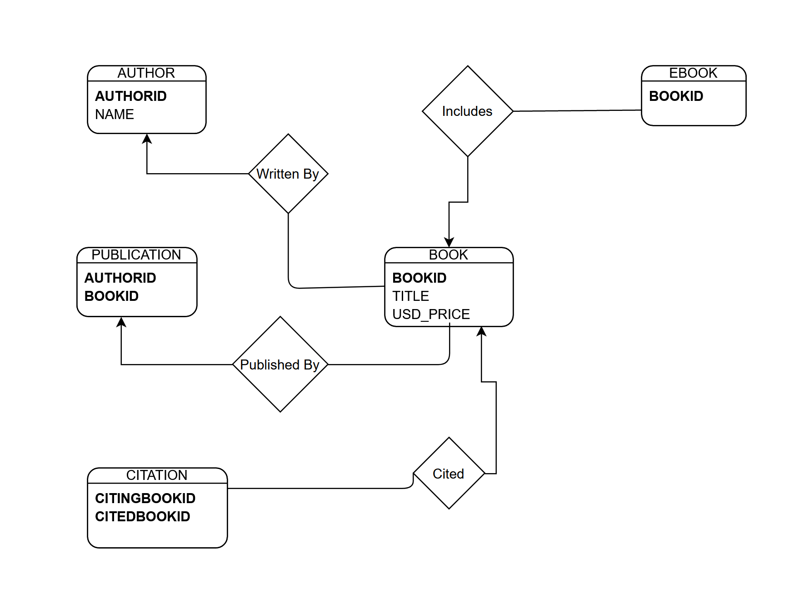

# Library_Management_System_Assignment
This is an assignment issued by university Of Michigun.It's 'bout establishing the backend part(database) and generating some query solely on a database tool.First look at the pretty simple ER diagram or the simplest:3



Or you can have a look at the DDL statements to get an idea about the Schema.

Now , let's look at the proposed query and their sql code;The results are shown for the DML statements included in this repository. 

## 1
With respect ot the “Library” database, write a SQL select statement to report all the authors’ names in alphabetical order. Make sure to not skip authors who have not published any book. Your SQL statement must produce a relation with schema [name]. 
```sql
SELECT name FROM authors ORDER BY name;
```
| name      |
|-----------|
| Buffy     |
| Chauncey  |
| Clareta   |
| Fina      |
| Jerrilyn  |
| Mirabella |
| Ned       |
| Sioux     |
| Sukey     |
| Tanitansy |

## 2
With respect to the “Library” database, write a SQL select statement to count the number of books authored by each person. Make sure to not ignore authors who have not published any book. Your SQL statement must produce a relation with schema [authorid, name, bookCount]. 
```sql
SELECT a.authorid , a.name , count(p.authorid) bookcount
FROM authors a LEFT JOIN publications p
ON a.authorid = p.authorid 
GROUP BY a.authorid, a.name , p.authorid
ORDER BY a.authorid;
```
| authorid | name      | bookcount |
|----------|-----------|-----------|
| 1        | Jerrilyn  | 1         |
| 3        | Sioux     | 1         |
| 7        | Buffy     | 1         |
| 2        | Fina      | 1         |
| 8        | Clareta   | 1         |
| 5        | Ned       | 1         |
| 9        | Mirabella | 1         |
| 6        | Chauncey  | 1         |
| 4        | Sukey     | 1         |
| 10       | Tanitansy | 1         |

## 3
With respect to the “Library” database, write a SQL select statement to identify all the authors who published at least one ebook in 'PDF' format. Your SQL statement must produce a relation with schema [authorid, name]. 
```sql
SELECT a.authorid , a.name
FROM authors a JOIN publications p
ON a.authorid = p.authorid
JOIN ebooks eb
ON eb.bookid = p.bookid AND eb.format='PDF';
```
| authorid | name      |
|----------|-----------|
| 1        | Jerrilyn  |
| 2        | Fina      |
| 3        | Sioux     |
| 4        | Sukey     |
| 5        | Ned       |
| 6        | Chauncey  |
| 7        | Buffy     |
| 8        | Clareta   |
| 9        | Mirabella |
| 10       | Tanitansy |

## 4
With respect to the “Library” database, write a SQL select statement to identify all the pairs of co-authors. Two individuals are co-authors if there is at least one book that lists both as authors. Identify each author by name. Do not report the same pair of authors more than once. Your SQL statement must produce a relation with schema [name1, name2]
```sql
SELECT a1.name name1 , a2.name name2
FROM authors a1,authors a2 ,

(SELECT p1.authorid at1 , p2.authorid at2
FROM publications p1 , publications p2
WHERE p1.bookid = p2.bookid AND p1.authorid<>p2.authorid AND p1.authorid>p2.authorid) t

WHERE a1.authorid = t.at1 AND a2.authorid = t.at2;
```
| name1     | name2    |
|-----------|----------|
| Sioux     | Jerrilyn |
| Sioux     | Fina     |
| Mirabella | Sioux    |
| Sukey     | Sioux    |
| Chauncey  | Sioux    |
| Ned       | Sukey    |

## 5
With respect to the “Library” database, write a SQL select statement to identify the id and name of authors that cite their own work. Do not report the same author more than once. Your SQL statement must produce a relation with schema [authorid, name]
```sql
SELECT DISTINCT a.authorid , a.name
FROM (
     SELECT p.authorid a1 , c.citingbookid citing
     FROM publications p , citations c
     WHERE p.bookid = c.citingbookid
         ) t1
    ,
     authors a
    ,
     citations c ,
     (
     SELECT p.authorid a2 , c.citedbookid cited
     FROM publications p , citations c
     WHERE p.bookid = c.citedbookid
         ) t2
WHERE t1.a1 = t2.a2 AND a.authorid = t1.a1 AND c.citedbookid = t2.cited AND c.citingbookid = t1.citing;
```
| authorid | name  |
|----------|-------|
| 3        | Sioux |

## 6
With respect to the “Library” database, write a SQL select statement to identify all the authors who never published an ebook (notice that the publication of regular books should not be taken into consideration). Your SQL statement must produce a relation with schema [authorid, name]
```sql
SELECT authorid , name
FROM authors EXCEPT (
SELECT DISTINCT a.authorid ,  a.name
FROM authors a , publications p , ebooks eb
WHERE a.authorid = p.authorid AND
      p.bookid = eb.bookid
);
```
| authorid | name      |
|----------|-----------|
| 11       | rfsdf     |
| 7        | Buffy     |
| 10       | Tanitansy |

## 7
With respect to the “Library” database, write a SQL select statement to identify all the authors who published more than five books. Your SQL statement must produce a relation with schema [authorid, name]
```sql
SELECT a.authorid , a.name
FROM authors a
WHERE
(
    SELECT COUNT(p.authorid)
    FROM publications p
    WHERE p.authorid = a.authorid
    group by p.authorid
    )>=5;
```
| authorid | name  |
|----------|-------|
| 3        | Sioux |

